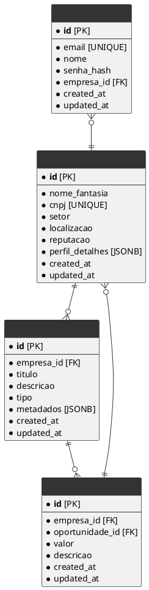

# SupplyBridge - Banco de Dados

Este repositório contém a documentação da arquitetura, o Diagrama de Entidade e Relacionamento (ERD) e os scripts de migração do banco de dados do projeto SupplyBridge.

---

## 📖 Sobre o Projeto

O **SupplyBridge** é uma plataforma B2B disruptiva projetada para funcionar como uma ponte entre empresas. O banco de dados é a fundação sobre a qual todo o sistema é construído, sendo responsável por garantir a consistência, performance e segurança dos dados, que são o ativo mais valioso da plataforma.

---

## 🏛️ Filosofia da Arquitetura

A arquitetura do banco de dados foi projetada com base em três pilares: **Consistência**, **Performance em Escala** e **Flexibilidade de Desenvolvimento**.

Para alcançar isso, adotamos uma abordagem de **Modelo Híbrido** dentro do PostgreSQL:

- **Núcleo Relacional**: As entidades centrais e transacionais (usuarios, empresas, oportunidades) seguem um modelo relacional normalizado para garantir a máxima integridade dos dados.
- **Flexibilidade com JSONB**: Para dados semi-estruturados ou dinâmicos (ex: preferências de usuário, metadados customizados), utilizamos o tipo JSONB nativo do PostgreSQL, evitando a complexidade de schemas rígidos e excesso de tabelas.

---

## 🚀 Stack de Ferramentas

| Tecnologia   | Função                        | Motivo da Escolha                                                |
|--------------|-------------------------------|------------------------------------------------------------------|
| PostgreSQL   | SGBD Principal                | Robusto, confiável, escalável e com recursos avançados           |
| SQLAlchemy   | ORM                           | Integração com a API em Python, segurança e produtividade        |
| Alembic      | Gerenciamento de Migrações    | Controle versionado e seguro da evolução do schema               |

---

## 🔑 Padrões de Modelagem e Otimização

- **Normalização (3FN)**: O núcleo relacional é projetado seguindo a 3ª Forma Normal para garantir uma fonte de verdade limpa e consistente.
- **Desnormalização Estratégica**: Para performance de leitura (ex: feed), utilizamos Views Materializadas otimizadas, preferencialmente atualizadas via eventos da aplicação.
- **Auditoria e Validação**: Todas as tabelas incluem `created_at`, `updated_at` e constraints como `UNIQUE`, `NOT NULL`, `CHECK`.
- **Escalabilidade Futura**: Uso de **Particionamento de Tabelas** planejado para entidades massivas como `mensagens_chat`, `logs_atividades`.

---

## 🗄️ Gerenciamento de Migrações (Alembic)

Toda alteração no schema deve ser feita via Alembic. Isso garante versionamento e consistência entre os ambientes.

### Fluxo:

```bash
# 1. Gerar migração com base nas alterações dos modelos
alembic revision --autogenerate -m "Descreva a sua alteração aqui"

# 2. Revisar o arquivo gerado em alembic/versions/

# 3. Aplicar migração
alembic upgrade head
```

---

## 🏁 Como Começar

O banco é parte do backend. Para rodar localmente, utilize o `docker-compose.yml` do repositório [`back-supply-bridge`](https://github.com/seu-usuario/back-supply-bridge).

---

## 🗺️ Diagrama de Entidade e Relacionamento (ERD)


--
